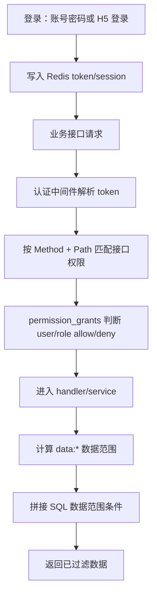

# 权限控制运行时说明

更新时间：2026-08-01

本文说明当前项目运行时的权限控制方式，覆盖管理后台、客户端、钉钉 H5 的接口权限、菜单/按钮权限，以及接口返回数据时的业务数据范围控制。

如果需要新增或修改权限编码，请同时参考 [权限编码与前端同步说明](PERMISSION_CODE_FRONTEND_SYNC.md)。

## 核心结论

当前整体链路是：

```text
登录认证 -> 接口权限校验 -> 业务数据权限过滤
```

这里的“数据库权限”指业务数据范围控制，不是 MySQL/PostgreSQL 账号级 `GRANT`。

三端严格程度不同：

| 端 | 路由范围 | 认证 | 接口权限 | 权限未初始化时 |
| --- | --- | --- | --- | --- |
| 管理后台 | `/api/v2/admin/*` | `AdminAuth` | `AdminPerm` | 未声明或未授权默认拒绝 |
| 客户端 v2 | `/api/v2/*` | `ClientAuth` | `ClientPerm` | 权限表缺失或无该平台授权时拒绝 |
| 钉钉 H5 | `/api/v2/dingtalk/h5/*` | `dingtalkh5.Auth` | `dingtalkh5.ApiPerm` | 权限表缺失或无该平台授权时拒绝 |
| 旧客户端 | `/passport`、`/fav` 等旧已登录路由 | `ClientAuth` | `ClientPerm` | 权限表缺失或无该平台授权时拒绝 |

## 核心模型

当前权限底座使用两张统一权限表：

| 表 | 作用 |
| --- | --- |
| `permissions` | 定义权限点，例如后台菜单、后台接口、客户端接口、钉钉 H5 菜单/API、数据权限。 |
| `permission_grants` | 保存授权关系，支持给 `role` 或 `user` 授权，也支持 `allow` 和 `deny`。 |

相关业务表：

| 表 | 作用 |
| --- | --- |
| `users` | 登录用户表，后台、客户端、钉钉 H5 都基于用户身份。 |
| `roles` | 角色基础信息，`role_status = 1` 才能生效。 |
| `user_roles` | 用户多角色绑定表，支持一个用户同时拥有后台、客户端、钉钉 H5 等多个角色。 |
| `user_depts` | 用户所属部门，也是数据范围过滤的重要来源。 |

权限编码约定：

| 类型 | 示例 | 用途 |
| --- | --- | --- |
| 后台入口 | `admin:login` | 判断用户角色是否允许进入后台。 |
| 后台菜单/按钮 | `admin:menu:user`、`admin:menu:user:add` | 控制后台菜单树和页面按钮显示。 |
| 后台接口 | `admin:api:user:list`、`admin:api:user:edit` | 控制 `/api/v2/admin/*` 接口是否放行。 |
| 客户端菜单 | `client:menu:home` | 客户端菜单权限目录，当前客户端前端菜单仍偏静态。 |
| 客户端接口 | `client:api:news:view` | 控制客户端 v2 登录态接口是否放行。 |
| 钉钉 H5 菜单/按钮 | `dingtalk_h5:menu:performance`、`dingtalk_h5:button:review:create` | 控制钉钉 H5 菜单和页面按钮。 |
| 钉钉 H5 接口 | `dingtalk_h5:api:bootstrap:view`、`dingtalk_h5:api:review:list` | 控制钉钉 H5 登录态接口是否放行。 |
| 数据权限 | `data:all`、`data:dept`、`data:self`、`data:custom`、`data:extra` | 控制业务数据可见范围。 |

权限展示字段：

| 字段 | 用途 |
| --- | --- |
| `permissions.permission_name` | 后台权限树和钉钉 H5 菜单显示名称。 |
| `permissions.permission_icon` | 菜单图标配置；后台菜单使用 Element Plus 图标名，钉钉 H5 菜单使用 H5 内置图标键。 |

## 总体链路



## 授权优先级

统一授权表支持角色授权和用户独立授权：

1. 角色授权是基础权限。
2. 用户级 `allow` 可以补充角色没有的权限。
3. 用户级 `deny` 可以禁止角色已有的权限。
4. 接口权限判断时，用户级禁止优先于角色级允许。
5. 数据权限也优先读取用户级授权；用户没有数据权限时再读取角色授权。

## 多角色规则

用户可以同时绑定多个启用角色：

1. `users.user_role_id` 是主角色，兼容旧接口和用户列表展示。
2. `user_roles` 保存完整角色集合，其中 `user_role_is_primary = 1` 表示主角色。
3. 后台、客户端和钉钉 H5 的菜单、按钮、接口权限按所有启用角色取并集。
4. 用户级 `deny` 仍然优先于所有角色级 `allow`。
5. 数据权限优先读取用户级基础授权；用户没有基础数据权限时，按所有启用角色合并计算基础数据范围。
6. 后台用户表单支持多选角色，保存时第一个角色会同步为 `users.user_role_id`。

## 管理后台权限流程

### 登录和入口权限

后台登录成功前，会检查用户是否允许进入后台：

1. 用户状态必须可用。
2. 用户必须至少绑定一个启用状态的角色。
3. 任一启用角色是保留的“超级管理员”，或用户/任一角色拥有 `admin:login`。
4. 登录成功后，token 写入 Redis。

相关代码：

| 能力 | 文件 |
| --- | --- |
| 后台登录 | `backend/internal/service/admin/adminauth/service.go` |
| 后台入口判断 | `backend/internal/support/adminaccess/adminaccess.go` |
| 后台认证中间件 | `backend/internal/middleware/admin/auth.go` |

### 菜单和按钮

后台菜单不是从旧 `menus` 表直接读取，而是从 `permissions` 和 `permission_grants` 聚合。

运行链路：

1. 登录后前端请求 `/api/v2/admin/me/menus` 获取可见菜单树。
2. 登录后前端请求 `/api/v2/admin/me/perms` 获取当前用户权限 key。
3. 侧边栏使用菜单树渲染。
4. 页面按钮使用 `hasPerm('admin:menu:*')` 控制显示。
5. 菜单和按钮只是体验层控制，真正安全边界仍是后端接口权限。

相关代码：

| 能力 | 文件 |
| --- | --- |
| 后台菜单服务 | `backend/internal/service/admin/menu/service.go` |
| 后台菜单声明 | `backend/internal/support/adminmenuperm/declarations.go` |
| 后台前端菜单渲染 | `admin/src/views/layout/index.vue` |
| 后台前端按钮权限 | `admin/src/utils/permission.ts` |

### 接口权限

`/api/v2/admin/*` 统一经过：

```text
AdminAuth -> AdminPerm -> Handler
```

判断过程：

1. `AdminAuth` 从 `Authorization` 读取 token，并从 Redis 还原当前管理员上下文。
2. `AdminPerm` 先判断是否为保留超级管理员角色，是则直接放行。
3. 非超级管理员按 `HTTP Method + Path` 查后台路由权限声明。
4. 未声明的后台路由默认拒绝。
5. 权限声明为空字符串的路由表示登录后允许，例如 `/api/v2/admin/me/menus`。
6. 找到声明后，权限编码会转换为 `admin:api:*`。
7. 读取 `permission_grants` 判断用户或任一角色是否拥有该接口权限。
8. 用户级 `deny` 命中时拒绝。

相关代码：

| 能力 | 文件 |
| --- | --- |
| 后台路由注册 | `backend/internal/routes/v2/admin/routes.go` |
| 后台接口权限中间件 | `backend/internal/middleware/admin/permission.go` |
| 后台路由权限声明 | `backend/internal/middleware/admin/route_permissions.go` |
| 后台接口权限目录 | `backend/internal/support/adminrouteperm/catalog.go` |

## 客户端权限流程

新版客户端 `/api/v2/*` 统一经过：

```text
ClientAuth -> ClientPerm -> Handler
```

判断过程：

1. `ClientAuth` 从 Redis token 中恢复用户上下文。
2. `ClientPerm` 根据 `HTTP Method + Path` 匹配 `client:api:*` 权限。
3. 用户级 `deny` 命中时拒绝。
4. 用户或任一角色拥有该 `client:api:*` 时放行。
5. 如果统一权限表不存在，或当前用户/角色集合没有任何客户端 API 授权，则拒绝访问。

注意：

- 客户端 v2 和旧客户端已登录路由都按 `client:api:*` 严格校验，不再在权限未初始化时兼容放行。
- 旧客户端已登录路由复用 `ClientPerm` 和 `client:api:*` 权限；公开路由仍保持公开访问。
- 当前客户端接口多已使用 `/api/v2`，但客户端菜单显示仍偏静态；后端能控制接口，不等于客户端菜单已完全按权限动态渲染。

相关代码：

| 能力 | 文件 |
| --- | --- |
| 客户端 v2 路由注册 | `backend/internal/routes/v2/client/routes.go` |
| 旧客户端路由注册 | `backend/internal/routes/v1/client/routes.go` |
| 客户端认证中间件 | `backend/internal/middleware/client/auth.go` |
| 客户端接口权限中间件 | `backend/internal/middleware/client/permission.go` |
| 客户端接口权限目录 | `backend/internal/support/appapiperm/catalog.go` |
| 客户端请求封装 | `frontend/utils/request.js` |

## 钉钉 H5 权限流程

钉钉 H5 登录接口不需要登录态：

```text
POST /api/v2/dingtalk/h5/login
```

登录成功后会创建 H5 session，并返回一份 bootstrap 权限快照。

除登录外，核心 H5 接口统一经过：

```text
dingtalkh5.Auth -> dingtalkh5.ApiPerm -> Handler
```

判断过程：

1. `Auth` 从 `Authorization` 或 query `token` 读取 H5 token。
2. 通过 Redis/session 恢复当前用户上下文。
3. `ApiPerm` 根据 `HTTP Method + Path` 匹配 `dingtalk_h5:api:*` 权限。
4. 权限表不存在、路由未声明、当前主体没有 H5 API 授权，都会拒绝。
5. 用户级 `deny` 命中时拒绝。
6. 用户或任一角色拥有对应 `dingtalk_h5:api:*` 时放行。

关键点：

- `/api/v2/dingtalk/h5/bootstrap` 本身也需要 `dingtalk_h5:api:bootstrap:view`。
- 如果用户登录成功但没有 bootstrap 接口权限，后续刷新 bootstrap 会返回 `无权限访问`。
- 这是当前“严格控制”后的预期行为，不再走工作台接口兜底拿菜单和权限。

相关代码：

| 能力 | 文件 |
| --- | --- |
| 钉钉 H5 路由注册 | `backend/internal/routes/v2/dingtalkh5/routes.go` |
| 钉钉 H5 认证中间件 | `backend/internal/middleware/dingtalk_h5/auth.go` |
| 钉钉 H5 接口权限中间件 | `backend/internal/middleware/dingtalk_h5/permission.go` |
| 钉钉 H5 API 权限目录 | `backend/internal/support/appapiperm/catalog.go` |
| 钉钉 H5 登录 | `backend/internal/service/dingtalkh5/auth/service.go` |
| 钉钉 H5 bootstrap / 权限快照 | `backend/internal/service/dingtalkh5/bootstrap/service.go` |
| 钉钉 H5 请求封装 | `dingtalk-h5/utils/request.js` |

### 钉钉 H5 菜单和按钮

钉钉 H5 前端不再通过工作台接口决定菜单权限，而是在登录后或 bootstrap 后读取：

| 字段 | 用途 |
| --- | --- |
| `menus` | 当前用户可见的一级/二级菜单。 |
| `buttonPermissionKeys` | 当前用户可用页面按钮。 |
| `apiPermissionKeys` | 当前用户可访问接口。 |
| `permissionVersion` | 权限版本，用于感知权限变化。 |

H5 前端使用方式：

1. 通过 `menus` 构建一级菜单和子菜单。
2. 菜单名称和图标来自 `permissions.permission_name`、`permissions.permission_icon`；没有配置图标时使用后端内置默认图标。
3. 用 `hasButtonPermission('dingtalk_h5:button:*')` 控制按钮显示。
4. 用 `hasApiPermission('dingtalk_h5:api:*')` 控制前端是否允许发起某些操作。
5. 后端仍通过 `ApiPerm` 再校验一次接口权限。

钉钉 H5 目前支持的菜单图标键：

| 图标键 | 默认用途 |
| --- | --- |
| `dashboard` | 工作台 |
| `performance` | 绩效管理 |
| `mine` | 我的绩效 |
| `history` | 历史绩效 |
| `manager` | 上级评价 |
| `hrbp` | HRBP 评价 |
| `summary` | HRBP 汇总 |
| `org` | 流程执行 |
| `template` | 绩效模版 |
| `account` | 用户账号 |

示例：创建考评单需要同时满足：

```text
dingtalk_h5:button:review:create
dingtalk_h5:api:review:create
```

相关代码：

| 能力 | 文件 |
| --- | --- |
| 钉钉 H5 菜单/按钮声明 | `backend/internal/support/appmenuperm/catalog.go` |
| 钉钉 H5 页面权限消费 | `dingtalk-h5/pages/index/index.vue` |
| 钉钉 H5 API 调用 | `dingtalk-h5/services/dingtalkH5Api.js` |

## 角色和用户授权写入

角色编辑保存时会写入：

| 权限 | 写入内容 |
| --- | --- |
| 后台权限 | `admin:login`、`admin:menu:*`、`admin:api:*`、`data:*` |
| 应用菜单权限 | `client:menu:*`、`dingtalk_h5:menu:*`、`dingtalk_h5:button:*` |
| 应用接口权限 | `client:api:*`、`dingtalk_h5:api:*` |

用户编辑保存时会写入：

| 权限 | 写入内容 |
| --- | --- |
| 用户角色 | `users.user_role_id` 主角色和 `user_roles` 多角色绑定 |
| 用户额外授权 | 用户级 `allow` |
| 用户禁止权限 | 用户级 `deny` |
| 用户额外数据权限 | `data:extra`，包含额外可见部门和额外可见用户 |

相关代码：

| 能力 | 文件 |
| --- | --- |
| 角色保存 | `backend/internal/service/admin/role/service.go` |
| 用户保存 | `backend/internal/service/admin/adminuser/service.go` |
| 权限写入工具 | `backend/internal/support/permission/service.go` |

## 数据权限流程

数据权限用于控制接口返回和操作的业务数据范围，不是数据库账号权限。

支持的数据范围：

| 权限 | 含义 | 常见 SQL 表现 |
| --- | --- | --- |
| `data:all` | 全部数据 | 不追加数据范围条件。 |
| `data:dept` | 本部门及子部门 | 使用用户所属部门和子部门过滤资源部门字段。 |
| `data:self` | 本人数据 | 使用当前用户 ID 过滤资源创建人字段。 |
| `data:custom` | 自定义部门 | 使用授权 scope 中的 `deptIds` 过滤资源部门字段。 |
| `data:extra` | 用户额外可见范围 | 额外 OR 上指定部门或指定用户。 |

角色表 `roles.role_data_scope` 仅保留 1/2/3/4 的基础范围兼容值：1=全部、2=本部门及子部门、3=本人、4=自定义部门。运行时以统一授权 `data:*` 为准；`data:extra` 只作为用户级额外授权，通过 `permission_grants.grant_scope_value` 追加可见部门或用户，不写入 `roles.role_data_scope`。

读取规则：

1. 优先读取用户级 `data:*`。
2. 用户没有基础数据权限时读取所有启用角色的 `data:*`，按 `data:all`、`data:dept`、`data:custom`、`data:self` 的宽度合并；多个 `data:custom` 会合并部门范围。
3. 用户级 `data:extra` 会在基础范围之外追加可见部门或可见用户。
4. 多角色菜单/API 权限做并集；基础数据权限做最宽范围合并，避免较窄角色覆盖较宽角色。
5. 超级管理员通常不追加数据范围过滤。

### 标准字段

资源表统一使用以下审计字段：

| 字段 | 作用 |
| --- | --- |
| `create_by` | 创建人用户 ID。 |
| `update_by` | 更新人用户 ID。 |
| `create_dept_id` | 创建人部门 ID，用于部门数据范围过滤。 |
| `update_dept_id` | 更新人部门 ID。 |
| `add_time` | 创建时间。 |
| `edit_time` | 更新时间。 |

常见后台资源通过 `ResourceAuditFields` 映射这些字段，默认数据范围优先用资源部门字段，没有专门业务部门字段时使用 `create_dept_id`。

注意：不是所有表都按 `create_by` 过滤。

| 场景 | 数据范围方式 |
| --- | --- |
| 普通业务资源 | 通常按 `create_dept_id` 或 `create_by` 过滤。 |
| 用户列表 | 按 `users.id` 和 `user_depts` 关系过滤。 |
| 部门列表 | 按当前用户可见部门树过滤。 |
| 钉钉 H5 绩效单 | 使用绩效单专用可见性和数据范围逻辑。 |

相关代码：

| 能力 | 文件 |
| --- | --- |
| 数据权限计算 | `backend/internal/support/permission/service.go` |
| 通用数据范围 helper | `backend/internal/support/access/access.go` |
| 资源字段映射 | `backend/internal/support/access/resource_fields.go` |
| 钉钉 H5 绩效数据范围 | `backend/internal/service/dingtalkh5/performance/review/scope/scope.go` |
| 钉钉 H5 绩效可见性 | `backend/internal/service/dingtalkh5/performance/review/scope/scope.go` |

## 新增接口检查清单

新增或调整接口时，至少检查：

1. 是否注册在正确路由组。
2. Admin 接口是否加入后台路由权限声明。
3. 客户端或钉钉 H5 接口是否加入 `appapiperm` 目录。
4. 是否同步创建或迁移 `permissions` 中的内置权限点。
5. 角色/用户表单是否能展示并保存该权限。
6. 前端是否有硬编码 `hasPerm`、`hasApiPermission`、`hasButtonPermission` 需要同步。
7. 查询、详情、编辑、删除、导出是否接入数据范围过滤。
8. 是否存在旧接口路径绕过新权限体系。
9. 管理端 service 新增 `ForAdminContext` 方法时，`backend/internal/service` 根包的数据范围守卫测试是否通过。

## 排查权限问题的顺序

### 后台无法进入

1. `users.user_status` 是否启用。
2. `users.user_role_id` 是否绑定角色。
3. `roles.role_status` 是否启用。
4. 角色或用户是否拥有 `admin:login`。
5. 是否为保留超级管理员角色。

### 菜单不显示

1. `permissions` 是否存在对应 `admin:menu:*` 或 `dingtalk_h5:menu:*`。
2. `permissions.permission_status` 是否启用。
3. `permission_grants` 是否给角色或用户授权。
4. 用户级是否存在 `deny`。
5. 钉钉 H5 是否重新登录或重新拉取 bootstrap。

### 接口返回无权限

1. 路由是否有权限声明。
2. 是否存在对应 `admin:api:*`、`client:api:*` 或 `dingtalk_h5:api:*` 权限点。
3. 当前用户或角色是否有 `allow`。
4. 当前用户是否有 `deny`。
5. 钉钉 H5 是否缺少 `dingtalk_h5:api:bootstrap:view`。
6. 前端判断的权限 key 是否和后端声明一致。

### 数据显示过少或过多

1. 当前用户是否有用户级 `data:*` 覆盖。
2. 角色是否有 `data:*`。
3. `data:custom` 的 scope 是否包含正确 `deptIds`。
4. `data:extra` 是否包含额外可见部门或用户。
5. 对应 service 是否接入 `access` helper 或业务专用数据范围逻辑。
6. 资源字段映射是否使用了正确的 `create_by`、`create_dept_id` 或业务部门字段。

## 剩余风险

1. 旧客户端公开路由仍保持公开访问；如果后续要收紧，需要先确认历史客户端兼容性。
2. Admin 新增接口必须同步维护路由权限声明，否则会默认拒绝。
3. 数据权限不是全局 SQL 中间件；当前通过 service 根包结构测试约束管理端 `ForAdminContext` 方法必须使用数据范围 helper、可见性 guard 或委托到已保护方法。
4. 客户端菜单权限已进入权限目录，前端菜单展示已按客户端 bootstrap 权限快照过滤；原生 tabBar 仍需页面级守卫兜底。

## 关键代码位置

| 能力 | 文件 |
| --- | --- |
| v2 路由总注册 | `backend/internal/routes/v2/routes.go` |
| 钉钉 H5 路由注册 | `backend/internal/routes/v2/dingtalkh5/routes.go` |
| 旧客户端路由注册 | `backend/internal/routes/v1/client/routes.go` |
| 权限模型 | `backend/internal/model/permission/permission.go` |
| 统一权限服务 | `backend/internal/support/permission/service.go` |
| 后台认证中间件 | `backend/internal/middleware/admin/auth.go` |
| 后台接口权限中间件 | `backend/internal/middleware/admin/permission.go` |
| 后台路由权限声明 | `backend/internal/middleware/admin/route_permissions.go` |
| 客户端认证中间件 | `backend/internal/middleware/client/auth.go` |
| 客户端接口权限中间件 | `backend/internal/middleware/client/permission.go` |
| 钉钉 H5 认证中间件 | `backend/internal/middleware/dingtalk_h5/auth.go` |
| 钉钉 H5 接口权限中间件 | `backend/internal/middleware/dingtalk_h5/permission.go` |
| 后台菜单声明 | `backend/internal/support/adminmenuperm/declarations.go` |
| 后台接口权限目录 | `backend/internal/support/adminrouteperm/catalog.go` |
| 应用菜单/按钮权限目录 | `backend/internal/support/appmenuperm/catalog.go` |
| 应用接口权限目录 | `backend/internal/support/appapiperm/catalog.go` |
| 数据范围过滤 | `backend/internal/support/access/access.go` |
| 资源字段映射 | `backend/internal/support/access/resource_fields.go` |
| 钉钉 H5 权限快照 | `backend/internal/service/dingtalkh5/bootstrap/service.go` |
| 管理端数据范围守卫测试 | `backend/internal/service/admin_data_scope_guard_test.go` |
| 后台前端菜单渲染 | `admin/src/views/layout/index.vue` |
| 后台前端按钮权限 | `admin/src/utils/permission.ts` |
| 钉钉 H5 页面权限消费 | `dingtalk-h5/pages/index/index.vue` |
