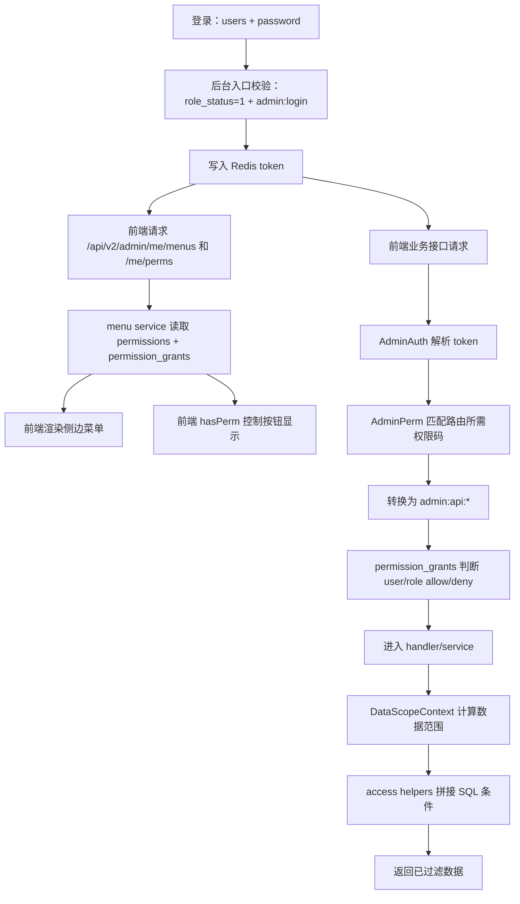

# 权限控制运行时说明

更新时间：2026-07-29

本文说明当前项目运行时的权限控制方式，覆盖管理后台菜单显示、前端请求接口时的接口权限判断，以及接口返回数据时的数据范围控制。

## 核心模型

当前权限底座使用两张统一权限表：

| 表 | 作用 |
| --- | --- |
| `permissions` | 定义权限点，例如后台菜单、后台接口、客户端菜单、钉钉 H5 菜单、数据权限。 |
| `permission_grants` | 保存授权关系，支持给 `role` 或 `user` 授权，也支持 `allow` 和 `deny`。 |

相关业务表：

| 表 | 作用 |
| --- | --- |
| `users` | 登录用户表，后台登录也使用这张表。 |
| `roles` | 角色基础信息，`role_status = 1` 才能生效。 |
| `user_depts` | 用户所属部门，也是数据范围过滤的重要来源。 |

权限编码约定：

| 类型 | 示例 | 用途 |
| --- | --- | --- |
| 后台入口 | `admin:login` | 判断用户角色是否允许进入后台。 |
| 后台菜单/按钮 | `admin:menu:user`、`admin:menu:user:add` | 控制后台菜单树和页面按钮显示。 |
| 后台接口 | `admin:api:user:list`、`admin:api:user:edit` | 控制 `/api/v2/admin/*` 接口是否放行。 |
| 客户端接口 | `client:api:news:view` | 控制客户端登录态接口是否放行。 |
| 钉钉 H5 接口 | `dingtalk_h5:api:review:list` | 控制钉钉 H5 登录态接口是否放行。 |
| 数据权限 | `data:all`、`data:dept`、`data:self`、`data:custom` | 控制后台接口查询和写入可见范围。 |

## 总体链路



## 后台菜单显示如何控制

后台菜单不是从旧 `menus` 表直接读取，而是从 `permissions` 中读取 `permission_platform = admin` 且 `permission_type` 为 `directory/menu/button` 的权限点。

运行链路：

1. 管理后台登录成功后，前端会请求：
   - `/api/v2/admin/me/menus`：获取当前用户可见菜单树。
   - `/api/v2/admin/me/perms`：获取当前用户按钮权限码，例如 `user:add`、`role:edit`。
2. 这两个接口在路由权限声明中属于“登录后显式允许”，即只需要通过 `AdminAuth` 登录态校验。
3. 服务层仍会检查当前用户是否真的允许进入后台：
   - 用户状态必须可用。
   - 用户绑定的角色必须启用。
   - 角色是保留的“超级管理员”，或用户/角色拥有 `admin:login`。
4. 如果是保留的“超级管理员”角色，返回所有启用的后台菜单权限。
5. 普通角色会读取 `permission_grants`：
   - 先合并角色授权和用户独立授权。
   - 用户级 `deny` 会覆盖角色级 `allow`。
   - 只返回 `admin:menu:*` 且 `permissions.permission_status = 1` 的权限。
6. 正常情况下，前端侧边栏展示返回菜单树中的目录和菜单；按钮类型不作为侧栏菜单显示。
7. 页面里的“新增、编辑、删除”等按钮使用 `/me/perms` 返回的兼容权限码，通过 `hasPerm('user:add')` 控制显示。

注意：前端菜单和按钮控制只是体验层控制，不是安全边界。用户直接访问某个页面路由时，前端目前不会强制拦截，真正的安全边界在后端接口权限中间件。

当前前端 `layout` 里还存在默认菜单兜底：菜单树加载失败或返回空时，会展示 `fallbackMenuItems`。这可能造成“界面看得到菜单，但点击后接口无权限”的体验不一致，后续建议改成“加载失败显示错误，空菜单显示暂无权限”，不再用全量默认菜单兜底。

## 接口权限如何判断

### 管理后台接口

`/api/v2/admin/*` 路由统一经过：

```text
AdminAuth -> AdminPerm -> Handler
```

判断过程：

1. `AdminAuth` 从请求头 `Authorization` 读取 token，并从 Redis 还原当前后台用户信息。
2. `AdminPerm` 判断角色：
   - 保留的“超级管理员”角色直接放行。
   - 没有角色直接拒绝。
3. `AdminPerm` 根据 `HTTP Method + Path` 查找后台路由权限声明。
   - 未声明的后台路由默认拒绝。
   - 权限声明为空字符串的路由表示登录后允许，例如 `/api/v2/admin/me/menus`。
4. 找到所需兼容权限码后，例如 `user:list`，会转换成统一接口权限 key：`admin:api:user:list`。
5. 权限判断读取 `permission_grants`：
   - 先看用户级授权，如果用户级命中 `deny`，直接拒绝。
   - 如果用户级命中 `allow`，直接允许。
   - 如果用户级没有命中，再看角色级授权。
6. 任意一个所需接口权限满足即可放行，否则返回“无权限访问”。

### 客户端和钉钉 H5 接口

客户端和钉钉 H5 也使用统一权限表，但权限前缀不同：

| 平台 | 中间件 | 权限前缀 |
| --- | --- | --- |
| 客户端 | `ClientPerm` | `client:api:*` |
| 钉钉 H5 | `ApiPerm` | `dingtalk_h5:api:*` |

它们的判断方式和后台类似：先通过登录态中间件，再通过路由声明找到所需 API 权限 key，最后读取 `permission_grants` 判断用户和角色是否拥有该权限。

兼容策略：如果统一权限表还未就绪，或当前用户和角色尚未配置任何该平台 API 权限，客户端和钉钉 H5 会暂时放行，避免历史客户端突然不可用。后台管理接口不使用这个放行策略，未声明或未授权会拒绝。

## 数据权限如何决定返回范围

数据权限不是在响应返回前统一裁剪，而是在各个后台 service 查询数据时主动加 SQL 条件。

统一数据权限来源：

1. 优先读取用户自己的 `permission_grants` 中的 `data:*` 授权。
2. 用户没有数据权限授权时，再读取角色的 `data:*` 授权。
3. 如果统一权限没有配置，则返回默认空范围，具体业务按无额外数据范围处理；不再回退旧授权表。

数据范围模式：

| 权限 | 含义 | SQL 表现 |
| --- | --- | --- |
| `data:all` | 全部数据 | 不追加数据范围条件。 |
| `data:dept` | 本部门数据 | 使用当前用户在 `user_depts` 中绑定的部门过滤资源部门字段。 |
| `data:self` | 本人数据 | 使用当前用户 ID 过滤资源创建人字段。 |
| `data:custom` | 自定义部门数据 | 从 `permission_grants.grant_scope_value` 读取 `deptIds` 后过滤资源部门字段。 |

典型服务层调用：

```text
access.DataScopeFilterContext(ctx, admin, deptField, createByField)
access.ScopedResourceQueryContext(ctx, db, adminID, resource, deptField, createByField)
access.UserDataScopeFilterContext(ctx, admin)
access.VisibleDeptIDsContext(ctx, admin)
```

常见资源已经在 service 层接入数据权限，例如用户、部门、打卡、通知、赛事活动、问卷、考试、题库和控制台统计。写入、修改、删除类操作通常使用带范围的查询再配合 `RequireRowsAffected`，越权资源会表现为找不到或操作失败。

注意：数据权限不是全局自动生效。新增后台接口时，除了给路由补 `admin:api:*` 权限声明，还必须在 service 查询层接入 `access` 包的数据范围过滤，否则接口可能能访问超出范围的数据。

## 排查权限问题的顺序

1. 看用户是否能登录后台：
   - `users.user_status = 1`
   - `users.user_role_id > 0`
   - `roles.role_status = 1`
   - 角色或用户拥有 `admin:login`，或角色是“超级管理员”
2. 看菜单是否显示：
   - `permissions` 中是否存在对应 `admin:menu:*`
   - `permission_status` 是否为 1
   - `permission_grants` 是否给角色或用户授权
   - 用户是否存在对应 `deny`
3. 看按钮是否显示：
   - 对应菜单/按钮权限的 `permission_perms` 是否包含页面使用的 `hasPerm` 权限码
   - `/api/v2/admin/me/perms` 是否返回该权限码
4. 看接口是否被拒绝：
   - 路由是否在后台路由权限声明中
   - 是否存在对应 `admin:api:*` 权限点
   - 当前用户或角色是否被授予该 API 权限
   - 用户级是否存在 `deny`
5. 看接口数据是否少了或多了：
   - 当前用户是否有用户级 `data:*` 覆盖
   - 角色是否有 `data:*`
   - `data:custom` 的 `grant_scope_value` 是否包含正确部门 ID
   - 对应 service 是否接入了 `access` 包过滤

## 关键代码位置

| 能力 | 文件 |
| --- | --- |
| 权限模型 | `backend/internal/model/permission.go` |
| 统一权限服务 | `backend/internal/app/support/permission/service.go` |
| 后台入口判断 | `backend/internal/app/support/adminaccess/adminaccess.go` |
| 后台菜单服务 | `backend/internal/app/service/menu/service.go` |
| 后台接口权限中间件 | `backend/internal/middleware/admin_permission.go` |
| 后台路由权限声明 | `backend/internal/middleware/admin_route_permissions.go` |
| 客户端接口权限中间件 | `backend/internal/middleware/client_permission.go` |
| 钉钉 H5 接口权限中间件 | `backend/internal/app/handler/client/dingtalkh5/permission.go` |
| 数据范围过滤 | `backend/internal/app/support/access/access.go` |
| 后台菜单声明 | `backend/internal/app/support/adminmenuperm/declarations.go` |
| 后台接口权限声明 | `backend/internal/app/support/adminrouteperm/declarations.go` |
| 客户端/钉钉 H5 接口权限声明 | `backend/internal/app/support/appapiperm/catalog.go` |
| 后台前端菜单渲染 | `admin/src/views/layout/index.vue` |
| 后台前端按钮权限 | `admin/src/utils/permission.ts` |
