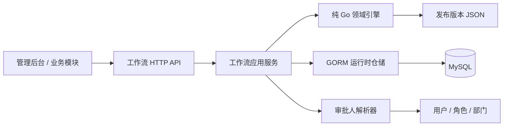
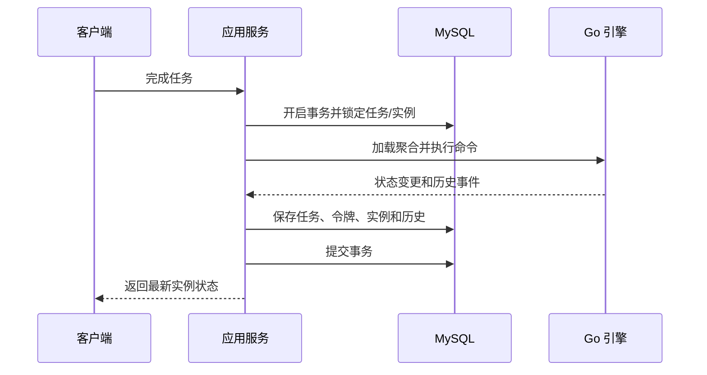

# 纯 Go 工作流引擎 V1 架构设计

## 1. 目标

在现有 `backend` Go 模块内新增独立工作流运行模块，完成流程定义发布、实例启动、待办生成、审批完成、条件分支、并行汇聚和历史审计的完整闭环。

本方案不依赖 Java、Flowable 服务或外部工作流运行时。现有 BPMN XML 继续作为导出与兼容产物，真正运行依据是发布版本冻结的 `definition_source_json`。

本设计替代 `flowable-runtime-integration.md` 中关于外部 Flowable REST 运行时的内容，现有流程定义与设计器接口保持兼容。

## 2. 模块边界

- `internal/workflow`：流程定义、校验和 BPMN 导出。
- `internal/modules/workflow/domain`：纯 Go 状态机，不依赖 GORM、Hertz 和业务模块。
- `internal/model/workflow`：运行实例、令牌、任务、变量和历史模型。
- `internal/service/admin/workflow`：事务、持久化、审批人解析和 API 编排。
- 业务模块后续通过工作流应用服务启动流程，不直接修改引擎内部状态。

## 3. 运行模型

### 3.1 流程实例

实例固定引用一个已发布版本。实例启动后，即使草稿或新版本发生变化，当前实例仍按原版本运行。

实例状态：

- `running`：运行中。
- `completed`：所有有效令牌到达结束节点。
- `rejected`：审批被拒绝并终止。
- `cancelled`：外部业务主动取消。

### 3.2 令牌

每条运行路径对应一个令牌。普通节点沿唯一后继移动；排他网关保留一条路径；并行分支复制令牌；并行汇聚等待同一分支组全部到达后合并为一个令牌。

### 3.3 审批任务

任务状态：`pending`、`approved`、`rejected`、`cancelled`。

审批方式：

- `single`：解析结果必须至少有一人，仅第一位审批人生成任务。
- `sequential`：按审批人顺序逐个生成任务，前一人通过后创建下一人任务。
- `parallel`：所有审批人同时生成任务，全部通过后继续。
- `countersign`：所有审批人同时生成任务，通过比例达到 `completionRate` 后继续，剩余任务取消。

任一有效任务拒绝时，V1 直接将实例置为 `rejected`，并取消同实例其他待办。退回、加签、转交和驳回到指定节点不属于 V1。

## 4. 网关语义

### 4.1 排他网关

按连线顺序计算条件，选择第一条满足条件的连线；没有条件命中时选择默认连线；既没有命中也没有默认连线时返回运行错误。

条件支持 `eq`、`ne`、`gt`、`gte`、`lt`、`lte`。数值比较统一转为高精度十进制文本后比较，避免 JSON 浮点精度丢失。

### 4.2 并行网关

- `split`：为每条离开连线创建令牌，并记录相同分支组。
- `join`：等待该分支组所有预期分支到达，随后结束这些令牌并创建一个继续令牌。

V1 要求并行分支使用成对的 `split` 与 `join`，不支持跨层交叉汇聚。

## 5. 持久化表

- `workflow_process_instances`：实例、发布版本、业务键、发起人和状态。
- `workflow_process_tokens`：活动路径、当前节点、分支组和状态。
- `workflow_process_tasks`：审批人、审批组、顺序、处理结果和意见。
- `workflow_process_variables`：实例变量，按键覆盖更新。
- `workflow_process_history`：追加写审计事件，不做覆盖更新。

关键约束：

- 同一流程定义下 `business_type + business_key` 可选唯一，防止业务重复启动。
- 任务完成使用事务和行锁，重复提交返回明确错误。
- 所有运行表记录创建人、更新时间；历史表记录操作人和事件时间。

## 6. API

- `POST /api/v2/admin/workflow-instances`：按流程定义启动实例。
- `GET /api/v2/admin/workflow-instances`：分页查询实例。
- `GET /api/v2/admin/workflow-instances/:id`：查询实例、当前任务和历史。
- `GET /api/v2/admin/workflow-tasks`：查询当前用户或指定实例的待办。
- `POST /api/v2/admin/workflow-tasks/:id/complete`：通过或拒绝任务。

运行 API 使用独立权限编码，避免与流程定义维护权限混用。

## 7. 事务与幂等

应用服务负责事务，领域引擎只负责确定性状态转换。同一待办只能从 `pending` 转换一次。

## 8. V1 不包含

- 定时器、触发器、服务任务和脚本任务。
- 子流程、流程迁移、动态加签、委托和转交。
- 外部 Flowable 自动部署和双写运行。
- 直接替换现有绩效流转；绩效模块待 V1 稳定后通过适配层接入。

